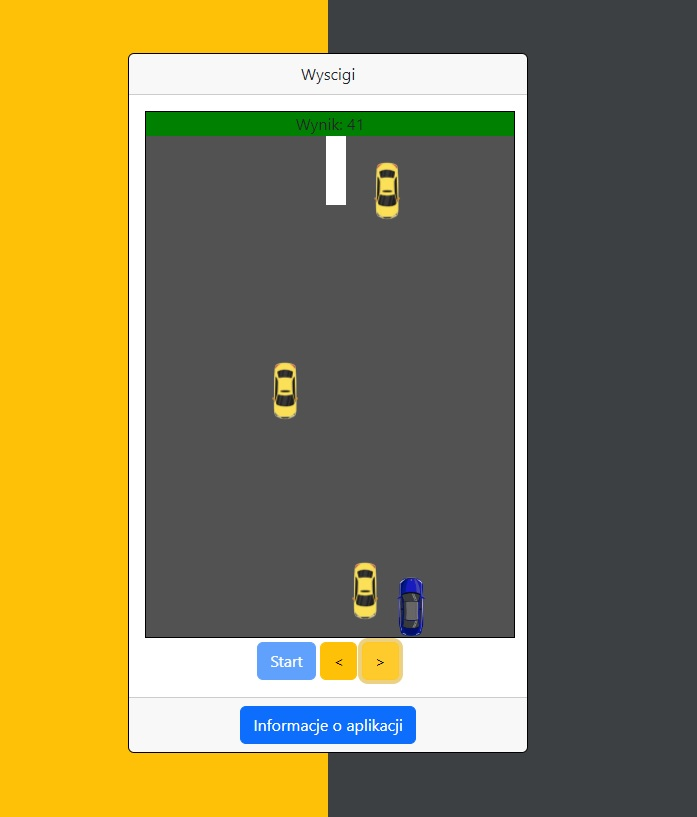

# :desktop_computer: Race

The application allows the user to control a car, and with each passing second, random cars appear driving towards it. The goal of the game is to avoid the other cars on the screen for as long as possible.

## :framed_picture: Screenshots

## :joystick: Demo

https://kamilkeder.github.io/Race/

## :e-mail: Feedback

If you have any feedback, please reach out to me at kontaktkkeder@gmail.com
